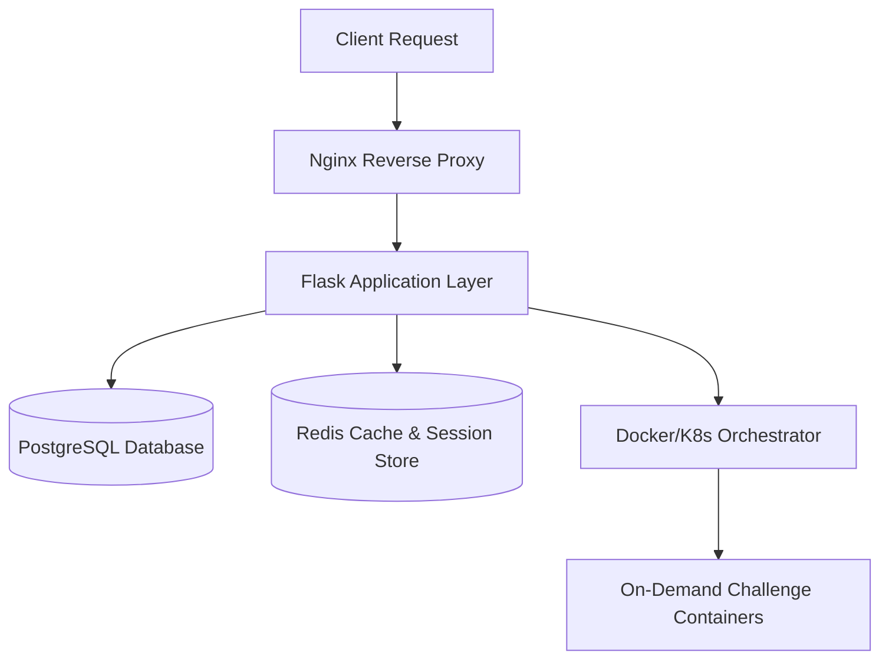

# Architectural Roadmap: Upgrading to a Production-Ready CTF Platform

This document outlines the necessary enhancements, architectural refactorings, and security measures required to transition this Flask-based CTF platform into a production-grade system capable of hosting real-world, high-traffic CTF competitions.

---

## 1. Core Architectural Upgrades

To support an active competition with hundreds of concurrent players, the codebase must shift from a hardcoded training style to a dynamic, database-driven, and highly available architecture.



### A. Dynamic Challenge Management (Database-Driven)
Currently, all challenges (stego, crypto, web, reverse) are hardcoded inside `app.py` under `__initialiser_defis()`. 
* **The Problem:** Adding or modifying a challenge requires changing the source code and restarting the server, which is unacceptable during a live competition.
* **The Solution:** Create a unified `Challenge` model in the database, along with a full CRUD admin portal.

```python
class ChallengeModele(db.Model):
    __tablename__ = "challenges"
    id = db.Column(db.String(64), primary_key=True)
    title = db.Column(db.String(128), nullable=False)
    description = db.Column(db.Text, nullable=False)
    category = db.Column(db.String(64), nullable=False)  # 'crypto', 'web', 'pwn', etc.
    initial_points = db.Column(db.Integer, default=500)
    current_points = db.Column(db.Integer, default=500)
    minimum_points = db.Column(db.Integer, default=50)
    flag_hash = db.Column(db.String(256), nullable=False)
    is_visible = db.Column(db.Boolean, default=False)
    file_attachment = db.Column(db.String(512), nullable=True)  # URL or filename
    lab_template = db.Column(db.String(128), nullable=True)     # Docker image to spawn
```

### B. Team-Based System
Real CTFs are typically played in teams rather than individual accounts. We need to introduce a `Team` model and update users so that they belong to teams.

* **Database Updates:**
  - Create a `TeamModele` (fields: `id`, `name`, `join_code` for invitation, `captain_id`, `score`).
  - Add a foreign key `team_id` in `UserModele`.
  - Update `SubmissionModele` and `AttemptModele` to record both `user_id` and `team_id`.
* **Scoreboard Aggregation:**
  - Change the scoreboard logic to sum team points and group by team.
  - Implement team management routes: `Create Team`, `Join Team (via token)`, and `Leave/Manage Team`.

---

## 2. Dynamic Scoring (Score Decay)

In real CTFs, challenges lose value as more teams solve them. This prevents "first bloods" from carrying the same weight as late solves and keeps the competition dynamic.

### The Dynamic Scoring Formula
A standard dynamic scoring formula:

$$\text{Points} = \text{MinPoints} + (\text{MaxPoints} - \text{MinPoints}) \times \left(1 - \frac{\min(\text{Solves}, \text{DecayLimit})}{\text{DecayLimit}}\right)$$

* **Implementation:**
  - Introduce a `ScoreDynamique` class implementing the `CalculateurScore` pattern:

```python
class ScoreDynamique(CalculateurScore):
    def __init__(self, val_max=500, val_min=50, limite_decroissance=20):
        self.val_max = val_max
        self.val_min = val_min
        self.limite_decroissance = limite_decroissance

    def calculer(self, solves_count: int) -> int:
        if solves_count <= 1:
            return self.val_max
        coef = min(solves_count, self.limite_decroissance) / self.limite_decroissance
        # Logarithmic or linear decay
        decayed_points = self.val_min + (self.val_max - self.val_min) * (1.0 - coef)
        return int(decayed_points)
```

Whenever a submission is successful, recalculate all scores for that challenge and update all users/teams that have already solved it.

---

## 3. Dynamic Challenge Orchestration (On-Demand Containers)

Web, PWN, and Reverse engineering challenges are often interactive. Running them all on a shared local port (e.g. `/lab/sqli/login` inside the main Flask app) is highly vulnerable:
* **Exploitation Collisions:** If User A hacks a database or edits a local state, User B will see User A's changes.
* **Denial of Service:** A user could write an infinite loop in a PWN lab, crashing it for everyone else.

### Architectural Solution: Container Spawning (Docker/K8s)

```
[User Interface] ──(Click 'Start Instance')──> [Flask API] 
                                                    │
                                             (Docker SDK / K8s API)
                                                    │
                                                    ▼
[User Gateway] <──(Unique URL / Port)───────── [New Isolated Container]
```

1. **Docker SDK Integration:** Write a background service in Flask that interacts with the Docker Daemon via `docker-py` or Kubernetes API to launch isolated containers on request.
2. **Dedicated User Instances:** When a user clicks **"Spawn Instance"** on a Web/PWN challenge:
   - The platform spawns a container from a pre-built Docker image.
   - The container gets a randomized subdomain/port (e.g., `inst-4a7b.challenges.ctf.com` or `ctf.com:31337`).
   - A reverse proxy (like Traefik or Nginx with dynamic routing) routes traffic to the specific user's container.
3. **Auto-Clean/TTL (Time-To-Live):** Containers are configured with an expiration timer (e.g., 30 minutes). Users can request extensions, but stale containers are automatically pruned to conserve memory/CPU.

---

## 4. Advanced Security & Anti-Cheat

### A. Rate Limiting Submissions
Brute-forcing flags is a common issue. You must implement rate limiting on the `/api/soumettre` route using **Flask-Limiter** backed by a **Redis** cache.
* **Limit:** Maximum 5 flag submissions per minute per IP/User.
* **Lockout:** If a user triggers the limit repeatedly, ban flag submissions for 10 minutes.

### B. Signed Dynamic Flags (Anti-Flag Sharing)
If a flag is static (e.g., `CTF{x0r_and_b4se64_master}`), once one user solves it, they can paste it to their friends.
* **Solution:** Generate flags dynamically based on the team's ID and sign them with a secret salt.
* **Example Algorithm:**
  - Base Flag: `CTF{congrats_you_hacked_us}`
  - Signature: `HMAC-SHA256(TeamID, SECRET_KEY)` (truncated to 8 characters)
  - Resulting flag shown in container: `CTF{congrats_you_hacked_us_8f3a9e1c}`
  - When a team submits a flag, extract the trailing hash and verify if it matches their specific team signature. If they submit another team's flag, trigger an automatic flag sharing alert.

### C. Network Isolation
Ensure the CTF hosting machine cannot access your internal local network or database. Challenge containers should run in a custom Docker bridge network with external internet access disabled (or heavily restricted) to prevent them from scanning your hosting environment or abusing resources.

---

## 5. Scalability & Operational Tools

### A. Database Transition
* **Currently:** Using SQLite (`ctf_platform.db`). SQLite locks the entire database file during writes. During a live competition, dozens of parallel flag submissions and scoreboard re-calculations will trigger `database is locked` errors.
* **Upgrade:** Use a robust relational database like **PostgreSQL** or **MariaDB**.

### B. Event Engine & Live Updates (WebSockets)
* **Scoreboard Polling:** Avoid fetching the entire scoreboard from the DB every 10 seconds.
* **WebSockets (Flask-SocketIO):** Push updates immediately when a challenge is solved. This allows:
  - Real-time scoreboard movement animations.
  - Broadcast of "First Bloods" (e.g., *"Team Alpha just got First Blood on NULLSIG (+10 points bonus)!"*).
  - Admin announcements (e.g., *"Challenge Caesar has been updated due to a typo"*).

### C. Logging, Auditing & SOC
* Log all incoming requests, correct flag submissions, and incorrect attempts.
* Record the IP address, User-Agent, and input payload for every request to `/api/soumettre`.
* Use these logs to identify malicious players trying to perform SQL Injection on the CTF platform itself.

---

## 6. Implementation Checklist

| Priority | Task | Description |
|---|---|---|
| 🔴 **P0** | **Database Migration** | Migrate from SQLite to PostgreSQL. |
| 🔴 **P0** | **Rate Limiter** | Implement `Flask-Limiter` with Redis on submission and authentication endpoints. |
| 🟡 **P1** | **Dynamic Challenges** | Replace hardcoded Python init code with DB-backed CRUD admin routes. |
| 🟡 **P1** | **Team System** | Implement `Team` model, join tokens, and group scoreboards. |
| 🟢 **P2** | **Dynamic Scoring** | Add dynamic point decay based on solve count. |
| 🟢 **P2** | **Event Engine** | Add WebSockets for real-time announcements/first-bloods. |
| 🔵 **P3** | **Orchestrator** | Deploy Traefik and Docker SDK connection to spawn on-demand labs. |
